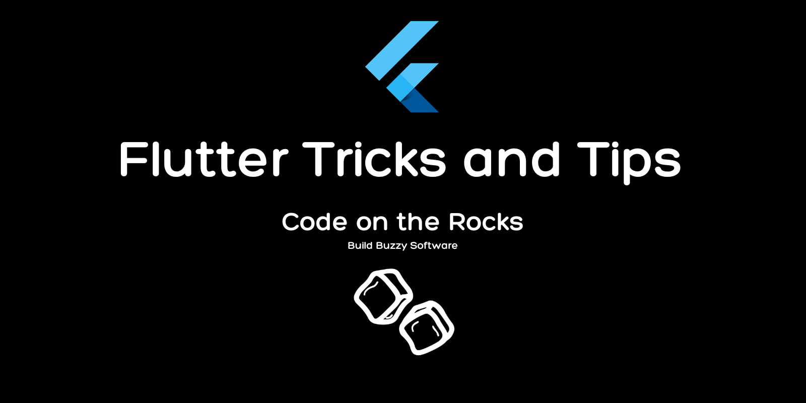

# Flutter Tricks and Tips
Below is a constantly expanding list of Flutter and Dart tricks. The most recent tips are at the top and new ones are added daily.

To see tips as soon as they are added, follow [@CodeOnTheRocks_](https://twitter.com/CodeOnTheRocks) on Twitter!

| # | Tip | Tweet |
| -- | --- | --- |
| 0055 | [Create a ColorScheme from your Logo](tips/0055-logo-colorscheme/tip.md) | [Tweet](https://twitter.com/CodeOnTheRocks_/status/1703745685831757834)  |
| 0053 | [Await Multiple Futures](tips/0053-future-wait/tip.md) | [Tweet](https://twitter.com/CodeOnTheRocks_/status/1702339630681538681)  |
| 0051 | [Use Perl in Fastlane](tips/0051-increment-build-number-with-perl/tip.md) | [Tweet](https://twitter.com/CodeOnTheRocks_/status/1701219043771138227)  |
| 0026 | [Use the Process Class to Run Executables](tips/0026-use-process-class/tip.md) | [Tweet](https://twitter.com/CodeOnTheRocks_/status/1699521602298548678)  |
| 0023 | [Material 3 IconButtons](tips/0023-material-3-icon-buttons/tip.md) | [Tweet](https://twitter.com/CodeOnTheRocks_/status/1699422701171945765)  |
| 0001 | [Programatically Open Drawer](tips/0001-programatically-open-drawer/tip.md) |  [Tweet](https://twitter.com/CodeOnTheRocks_/status/1704133542886969775) |
