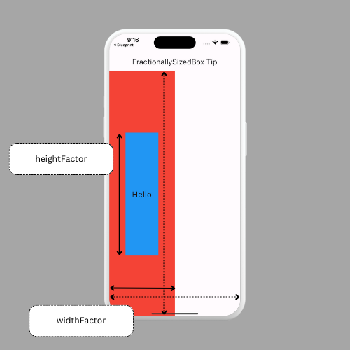

# Use FractionallySizedBox
You can use the [FractionallySizedBox](https://api.flutter.dev/flutter/widgets/FractionallySizedBox-class.html) widget to size a child widget based on a fraction of the parent widget's size.

```dart
FractionallySizedBox(
        widthFactor: .5,
        child: Container(
          color: Colors.red,
          child: Center(
            child: FractionallySizedBox(
              widthFactor: .5,
              heightFactor: .5,
              child: Container(
                color: Colors.blue,
                child: const Center(child: Text('Hello')),
              ),
            ),
          ),
        ),
),
```



This is useful for creating responsive layouts and when you want to limit the height of a modal bottom sheet.