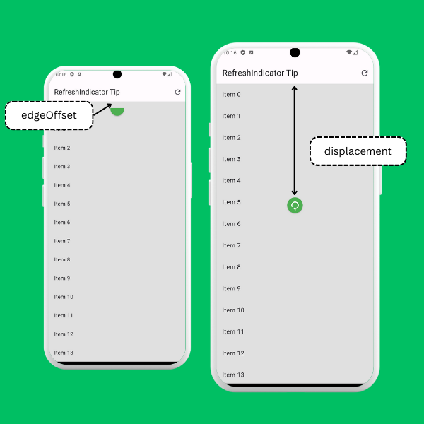

# Swipe to Refresh
You can use the RefreshIndicator widget to add a swipe-to-refresh feature to scrollable lists.

Just wrap the List in a RefreshIndicator and set the onRefresh callback.

Bonus: You can programmatically show the refresher using a GlobalKey 

```dart
// Create a GlobalKey for the RefreshIndicator
  final GlobalKey<RefreshIndicatorState> _refreshIndicatorKey = GlobalKey<RefreshIndicatorState>();

  @override
  Widget build(BuildContext context) {
    return Scaffold(
      backgroundColor: Colors.grey.shade300,
      appBar: AppBar(
        title: const Text('RefreshIndicator Tip'),
        actions: [
          IconButton(
            // Programmatically show the refresh icon
            onPressed: () => _refreshIndicatorKey.currentState?.show(),
            icon: const Icon(Icons.refresh),
          ),
        ],
      ),
      body: RefreshIndicator(
        key: _refreshIndicatorKey, // Add the key
        backgroundColor: Colors.green,
        color: Colors.white,
        displacement: 200,
        edgeOffset: 20,
        onRefresh: () async => await Future.delayed(const Duration(seconds: 1)),
        child: ListView.builder(
          itemCount: 100,
          itemBuilder: (context, index) {
            return ListTile(title: Text('Item $index'));
          },
        ),
      ),
    );
  }
```

