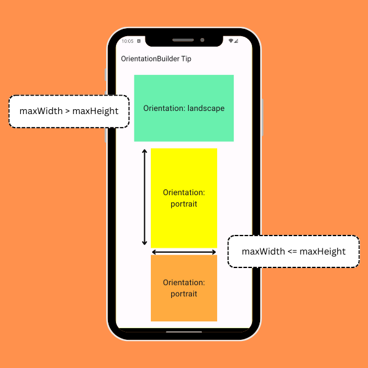

# Know your Orientation
The [OrientationBuilder](https://api.flutter.dev/flutter/widgets/OrientationBuilder-class.html) widget provides an Orientation value to its children based on the dimensions of the available space.

‼️This is NOT the device orientation ‼️

maxWidth > maxHeight = landscape

maxWidth <= maxHeight = portrait



```dart
 Widget build(BuildContext context) {
    return Scaffold(
      appBar: AppBar(title: const Text('OrientationBuilder Tip')),
      body: Center(
        child: Column(
          mainAxisAlignment: MainAxisAlignment.spaceEvenly,
          children: [
            SizedBox(
              height: 200,
              width: 300,
              child: ColoredBox(
                color: Colors.greenAccent,
                child: OrientationBuilder(
                  builder: (context, orientation) {
                    return Center(
                        child: Text(
                      'Orientation: ${orientation.name}',
                      textAlign: TextAlign.center,
                    ));
                  },
                ),
              ),
            ),
            SizedBox(
              height: 300,
              width: 200,
              child: ColoredBox(
                color: Colors.yellowAccent,
                child: OrientationBuilder(
                  builder: (context, orientation) {
                    return Center(
                        child: Text(
                      'Orientation: ${orientation.name}',
                      textAlign: TextAlign.center,
                    ));
                  },
                ),
              ),
            ),
            SizedBox(
              height: 200,
              width: 200,
              child: ColoredBox(
                color: Colors.orangeAccent,
                child: OrientationBuilder(
                  builder: (context, orientation) {
                    return Center(
                        child: Text(
                          'Orientation: ${orientation.name}',
                          textAlign: TextAlign.center,
                        ));
                  },
                ),
              ),
            )
          ],
        ),
      ),
    );
  }
```