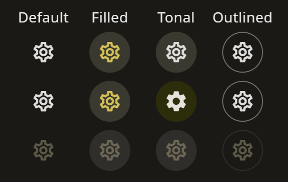

# Material 3 Icon Buttons
In [Flutter 3.10](https://docs.flutter.dev/release/release-notes/release-notes-3.10.0) there are new IconButton constructors. These only have an effect when your theme's useMaterial3 property is set to true.
```dart
class IconButtonTip extends StatelessWidget {
  const IconButtonTip({Key? key}) : super(key: key);

  @override
  Widget build(BuildContext context) {
    return Scaffold(
      appBar: AppBar(
        title: const Text('IconButton Tip'),
      ),
      body: Column(
        children: [
          IconButton(onPressed: () {}, icon: const Icon(Icons.settings)),
          IconButton.filled(onPressed: () {}, icon: const Icon(Icons.settings)),
          IconButton.filledTonal(onPressed: () {}, icon: const Icon(Icons.settings)),
          IconButton.outlined(onPressed: () {}, icon: const Icon(Icons.settings)),
        ],
      ),
    );
  }
}
```

