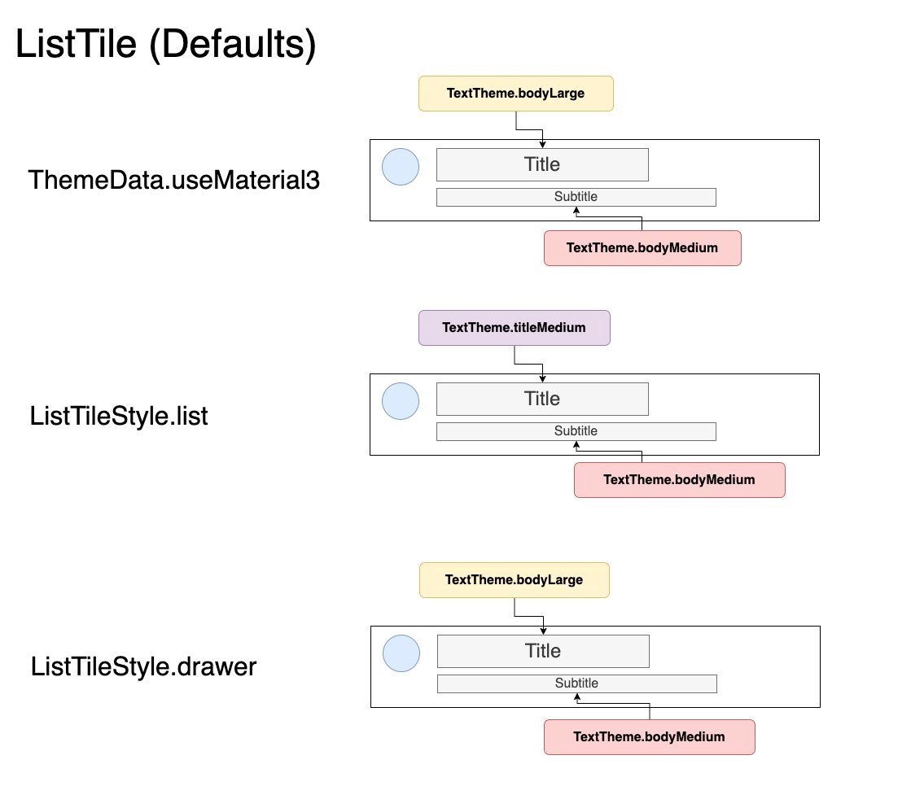

# The Many TextStyles of ListTile
The default ListTile TextStyles change depending on your theme and the [ListTileStyle](https://api.flutter.dev/flutter/material/ListTileStyle.html).

These styles can be overridden in your ListTileTheme (but its good to know what they start off as):

