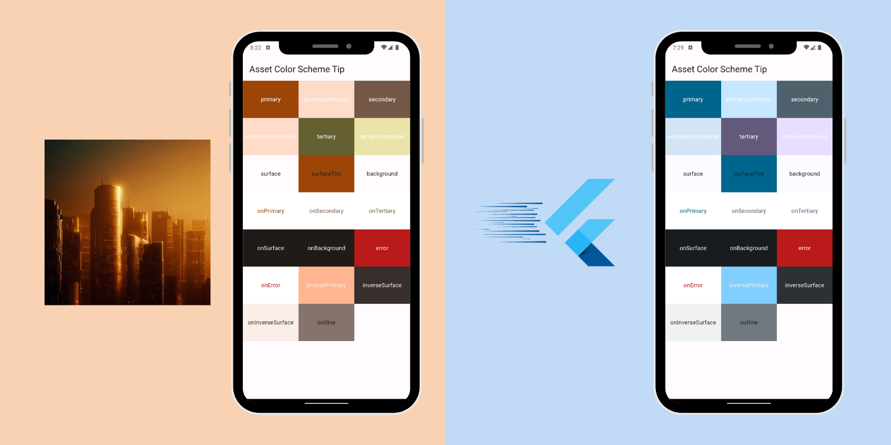

# Create a ColorScheme from your Logo
You can create a ColorScheme from an image using the [.fromImageProvider constructor](https://api.flutter.dev/flutter/material/ColorScheme/fromImageProvider.html) 🖌️

This constructor "extracts the dominant color" from your image and creates a ColorScheme with "harmnonious colors that meet contrast requirements for accessibility":

```dart
ColorScheme? colorScheme;

  void setColorScheme(ColorScheme val) {
    setState(() => colorScheme = val);
  }

  @override
  void initState() {
    super.initState();
    ColorScheme.fromImageProvider(provider: const AssetImage('assets/logo.jpeg')).then((value) {
      setColorScheme(value);
    });
  }
 ```

